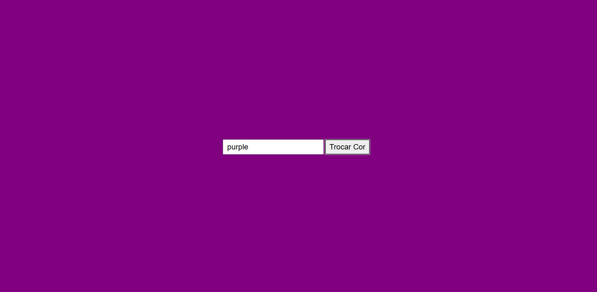

 # Projeto Trocar cor da Página

 

 ---
 ## Sobre
 Projeto do curso de desenvolvimento de sistema do SENAI Jandira, que tem como objetivo trocar a cor da tag body.

 ---
 ## Tencologias utilizadas
 - HTML
 - CSS
 - JS

 ---
 ## Autor

 - [Fernando Leonid](https://github.com/fernandoleonid/)